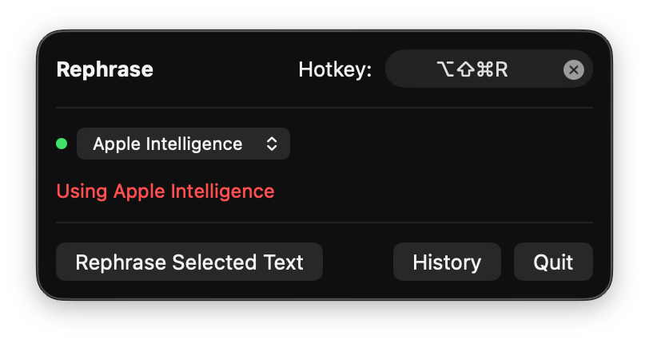
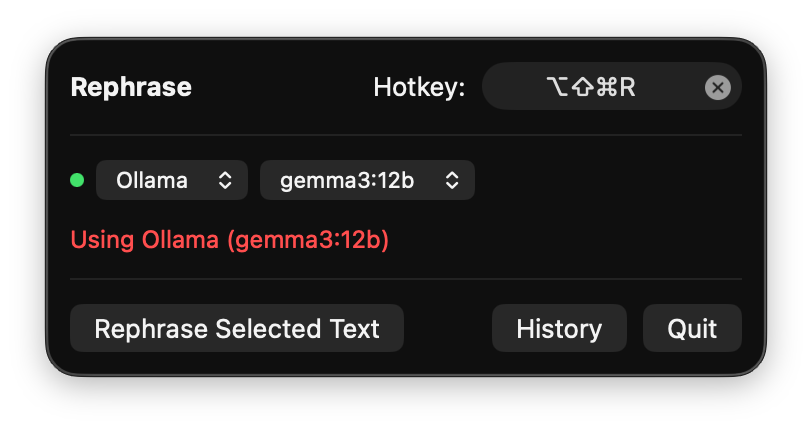
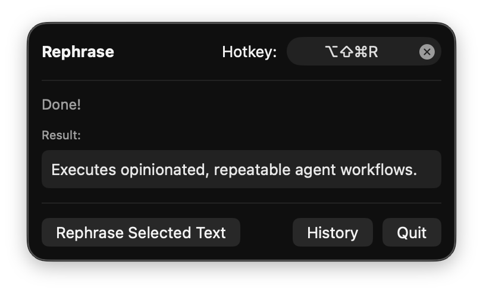
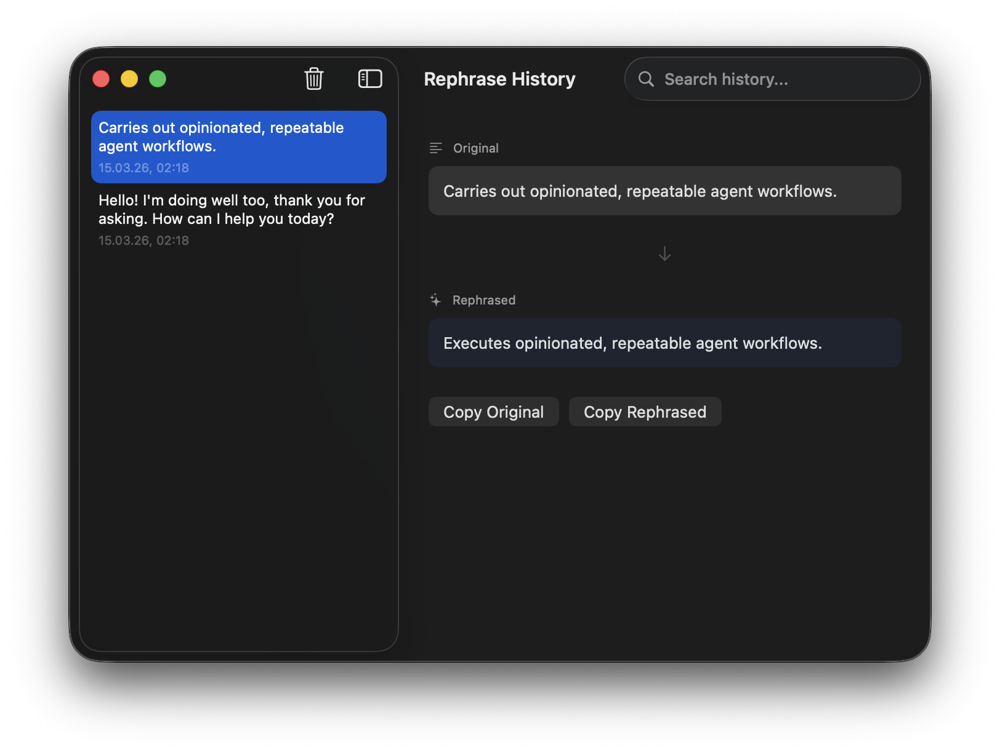

# AI Rephrase

A macOS menu bar app that rephrases selected text using on-device AI. Works in any application — select text, hit a shortcut, get a polished version instantly pasted back.

Uses Apple Intelligence when available, with automatic fallback to local Ollama models.

<p align="center">
  
  &nbsp;&nbsp;
  
</p>

<p align="center">
  
  &nbsp;&nbsp;
  
</p>

## Why?

Writing in a non-native language means constantly second-guessing your phrasing. AI Rephrase fixes that — select awkward text anywhere (Slack, email, docs, IDE), press one shortcut, and it gets rephrased in-place. No API keys, no cloud, no copy-pasting into ChatGPT.

## How It Works

1. Select text in **any** application
2. Press **⌥⇧⌘R** (customizable)
3. App copies the selection, sends it to on-device AI for rephrasing
4. Rephrased text is automatically pasted back

## Features

- **Works everywhere** — any app that supports text selection
- **One shortcut** — ⌥⇧⌘R (customizable in the menu bar popover)
- **Dual backend** — Apple Intelligence (on-device) or Ollama (local models)
- **Auto-detection** — picks the best available backend, manual switch anytime
- **Ollama model picker** — choose any locally installed model (gemma3, llama, etc.)
- **Persistent history** — browse all past rephrasings with search
- **Copy original or rephrased** — from the history window
- **Menu bar app** — no dock icon, stays out of your way
- **Native macOS** — SwiftUI, zero external API dependencies

## Backends

| Backend | When it's used |
|---|---|
| **Apple Intelligence** | macOS 26+, Apple Silicon, Apple Intelligence enabled, language set to English |
| **Ollama** | Fallback when Apple Intelligence is unavailable (e.g. non-English locale, disabled by policy) or manually selected |

You can switch between backends at any time via the dropdown in the menu bar popover.

## Requirements

- **macOS 26 (Tahoe)** or later
- **Apple Silicon** Mac (M1 or later)
- **Apple Intelligence** enabled — or **Ollama** running locally (`ollama serve`)

### Enabling Apple Intelligence

1. Open **System Settings → Apple Intelligence & Siri**
2. Make sure Apple Intelligence is turned **on**
3. If you see a language mismatch warning — set both Mac language and Siri language to **English (US)**
4. Wait for the on-device model to download (may take a few minutes on first setup)
5. Grant **Accessibility** permission to AiRephrase in **System Settings → Privacy & Security → Accessibility**

### Using Ollama as fallback

1. Install Ollama: `brew install ollama`
2. Pull a model: `ollama pull gemma3:12b`
3. Start the server: `ollama serve`
4. AI Rephrase will auto-detect Ollama if Apple Intelligence is unavailable

## Install

### Homebrew

```bash
brew install --cask alexrett/tap/ai-rephrase
```

### Download

Grab the latest `AiRephrase.dmg` from [Releases](https://github.com/alexrett/rephrase/releases).

### Build from Source

```bash
git clone https://github.com/alexrett/rephrase.git
cd rephrase
swift build -c release --arch arm64 --arch x86_64
```

## License

MIT
